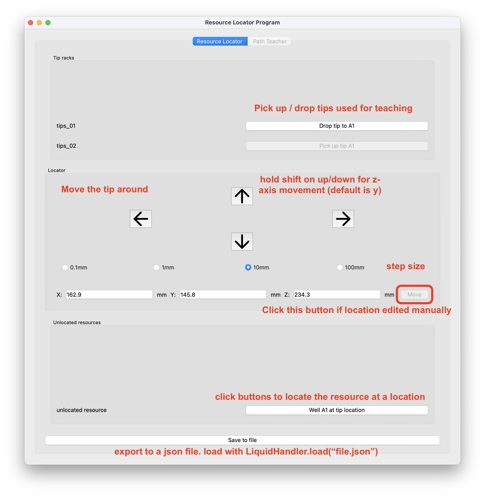
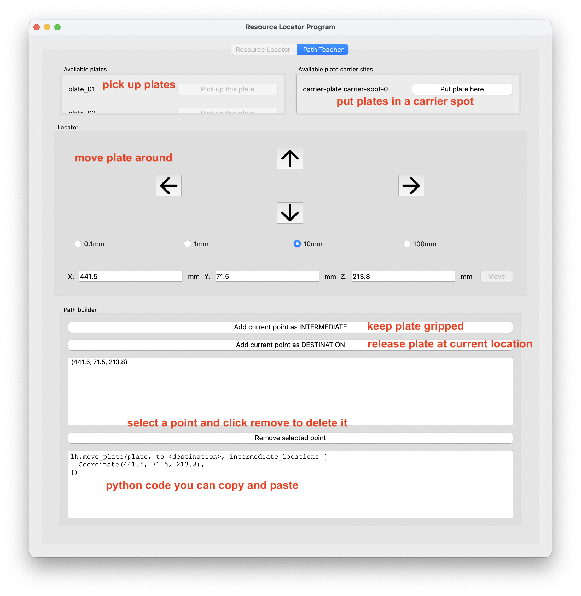

# PyLabRobot Resource Locator Program (PLR-RLP)

PyLabRobot Resource Locator Program (PLR-RLP) is a utility program to help you locate labware on a deck and design complex movement operations with iSWAP on Hamilton STAR. It is designed to be used with [the PyLabRobot project](https://github.com/pylabrobot/pylabrobot).

## Installation

### Users

```sh
pip install Resource-Locator-Program
```

### Development

1. Clone PyLabRobot:

```sh
git clone https://github.com/PyLabRobot/pylabrobot
```

2. Install PyLabRobot Resource Locator Program with cloned PyLabRobot:

```sh
git clone https://github.com/PyLabRobot/resource-locator-program
cd resource-locator-program
virtualenv env
source env/bin/activate
pip install -e '/path/to/pylabrobot[dev]'
pip install -e .
```

## Usage

Start the program with:

```sh
resource-locator-program
```

This will start the program in a new window.

### GUI

Use arrow keys to move the robot. Sometimes, another UI element is focussed and you will have to click a label to unfocus it (open an issue/pr if you have to fix this). You may also use `WASD`. Hold shift on the up/down arrows, `W` or `S`, or when pressing the buttons to move the resource up/down instead of front/back.

#### Resource locator

Resource locator is used to locate unidentified labware on the deck. Pick up a tip and move it to the labware. For plates, move it to the bottom center of well A1. For all other resources, move it to the top of the front left corner.



#### Path teacher

The path teacher only works on Hamilton STAR. It is used to design complex movements.



### Game controller

_Coming soon!_

---

Disclaimer: PyLabRobot is not officially endorsed or supported by any robot manufacturer. If you use a firmware driver such as is used here, you do so at your own risk. Usage of a firmware driver may invalidate your warranty. Please contact us with any questions.

Icons by [Feather](https://feathericons.com/).

_Developed for the Sculpting Evolution Group at the MIT Media Lab_
